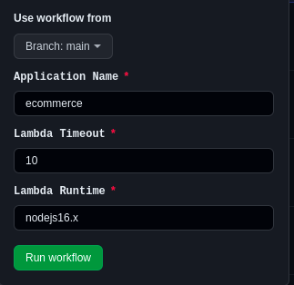
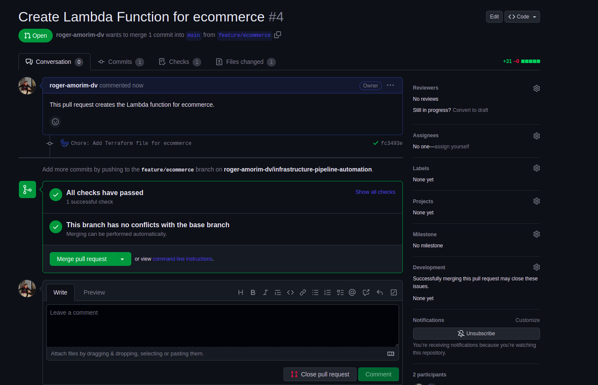
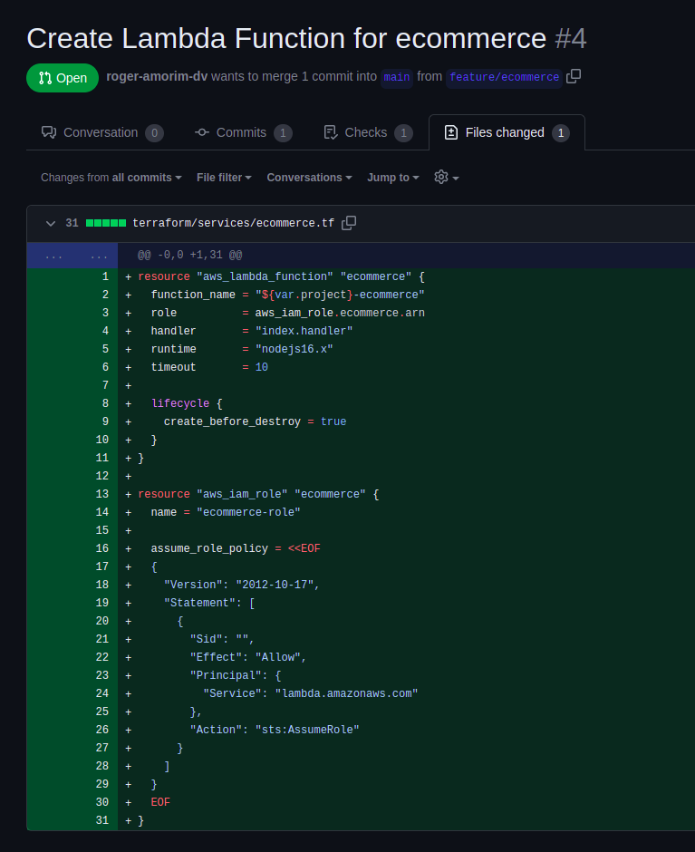

  

# Infrastructure Pipeline Automation

This project aims to automate the deployment and management of infrastructure pipelines. By leveraging the power of automation, this solution significantly reduces manual efforts and streamlines the process of setting up and maintaining infrastructure pipelines.

## Table of Contents
- [Introduction](#introduction)
- [Features](#features)
- [Usage](#usage)
- [Contributing](#contributing)

## Introduction

Infrastructure pipeline automation plays a crucial role in modern software development practices. It enables teams to rapidly provision, configure, and deploy infrastructure resources, allowing for more efficient development and deployment processes. This project provides a solution for automating infrastructure pipelines, making it easy to set up and manage pipelines with minimal manual intervention.

## Features

- **Automation:** The primary focus of this project is to automate the deployment and management of infrastructure pipelines. By eliminating manual steps, it reduces human error and speeds up the overall process.

- **Easy Configuration:** With just a few parameters, you can set up your infrastructure pipelines. The code is designed to be easily configurable, allowing you to adapt it to your specific requirements effortlessly.

- **Efficient Deployment:** The automation provided by this project ensures consistent and reliable deployment of infrastructure pipelines. You can rely on the code to handle the provisioning, configuration, and deployment tasks efficiently.

- **Scalability:** The project is designed to be scalable, allowing you to handle pipelines of various sizes and complexities. Whether you need a simple pipeline or a complex multi-environment setup, the automation provided can adapt to your needs.

## Usage

Once you have set up the Infrastructure Pipeline Automation project, you can utilize it in the following ways:

1. **Streamlined Deployment:** With automation in place, you can quickly and reliably deploy infrastructure pipelines. Simply provide the necessary parameters, and the code will handle the rest, ensuring a consistent and efficient deployment process.

2. **Error Reduction:** Manual steps in infrastructure pipeline deployment often introduce the risk of human error. By relying on this automated solution, you minimize the chances of mistakes and improve the overall reliability of your infrastructure setup.
   

3. **Simplified Management:** As your infrastructure requirements evolve, the automation code can be easily adjusted. With the provided configuration options, you can adapt the code to accommodate changes, making management and maintenance of the pipelines straightforward.

4. **Scalability and Flexibility:** The project is designed to handle various pipeline configurations. Whether you need a simple single-environment setup or a complex multi-environment architecture, the code can be extended and customized to suit your needs.

5. **Result:** The project result is a pull request created, with the necessary code to do something that you need and often.

## Contributing

Contributions to the Infrastructure Pipeline Automation project are welcome and encouraged! If you find any issues, have ideas for improvements, or would like to add new features, please submit a pull request. Be sure to follow the project's code style guidelines and provide clear documentation for your contributions.